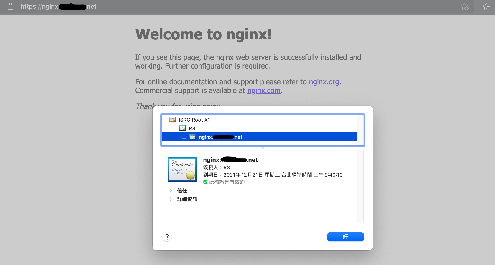

# eks-mg-lab

This Lab ref: [Securing NGINX-ingress](https://cert-manager.io/docs/tutorials/acme/ingress/)
```bash
# install nginx ingress controllers
helm repo update

# install nginx ingress controllers default create clb load balancer for svc load balancer.
helm install nginx-controller ingress-nginx/ingress-nginx

kubectl create deploy nginx --image=nginx  --port=80

kubectl expose deploy/nginx

kubectl get pod -l app=nginx -o "jsonpath={.items.*.metadata.name}"
```

```bash
# install cert-manager
kubectl apply -f https://github.com/jetstack/cert-manager/releases/download/v1.5.3/cert-manager.yaml

kubectl get pod -n cert-manager
NAME                                      READY   STATUS    RESTARTS   AGE
cert-manager-848f547974-gz5dg             1/1     Running   0          21s
cert-manager-cainjector-54f4cc6b5-tbtp5   1/1     Running   0          21s
cert-manager-webhook-7c9588c76-d6hzn      1/1     Running   0          21s
```

```bash
# create issuer
cat issuer.yaml | sed 's/EMAIL/xxxx@mail.com/g' | kubectl apply -f -

kubectl get issuer
NAME               READY   AGE
letsencrypt-prod   True    32s
```

```bash
# create ingress 
# xxx.yourdomain.com alias on nginx-controller svc clb on route53.

cat ingress.yaml | 's/HOST_NAME/xxx.yourdomain.com/g'| kubectl apply -f -


kubectl get ing
NAME    CLASS    HOSTS                ADDRESS                                                                              PORTS     AGE
nginx   <none>   xxx.yourdomain.com   bb58cf259898749fb83213axxxxxxxxx-xxxxxxxxx.ap-northeast-1.elb.amazonaws.com          80, 443   29s

kubectl describe ing nginx
Name:             nginx
Namespace:        default
Address:          bb58cf259898749fb83213axxxxxxxxx-xxxxxxxxx.ap-northeast-1.elb.amazonaws.com
Default backend:  default-http-backend:80 (<error: endpoints "default-http-backend" not found>)  # beacuse not define in ingress.yaml
TLS:
  nginx-tls terminates xxx.yourdomain.com 
Rules:
  Host                Path  Backends
  ----                ----  --------
  nginx.neilkuan.net  
                      /   nginx:80 (10.0.185.203:80)
Annotations:          cert-manager.io/issuer: letsencrypt-prod
                      kubernetes.io/ingress.class: nginx
Events:
  Type    Reason             Age                    From                      Message
  ----    ------             ----                   ----                      -------
  Normal  CreateCertificate  7m17s                  cert-manager              Successfully created Certificate "nginx-tls"
  Normal  Sync               6m50s (x2 over 7m17s)  nginx-ingress-controller  Scheduled for sync
```

### Try Connect `xxx.yourdomain.com`



## Clean up!!!
```bash
kubectl delete ing nginx

kubectl delete issuer letsencrypt-prod

kubectl delete -f https://github.com/jetstack/cert-manager/releases/download/v1.5.3/cert-manager.yaml

helm ls

helm uninstall nginx-controller
```

### CDK Destroy
```bash
cdk destroy
```